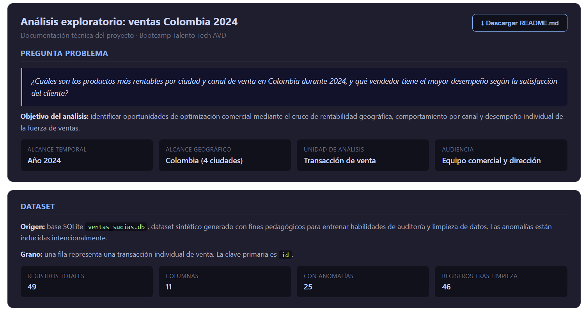
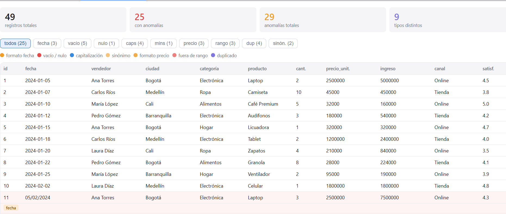
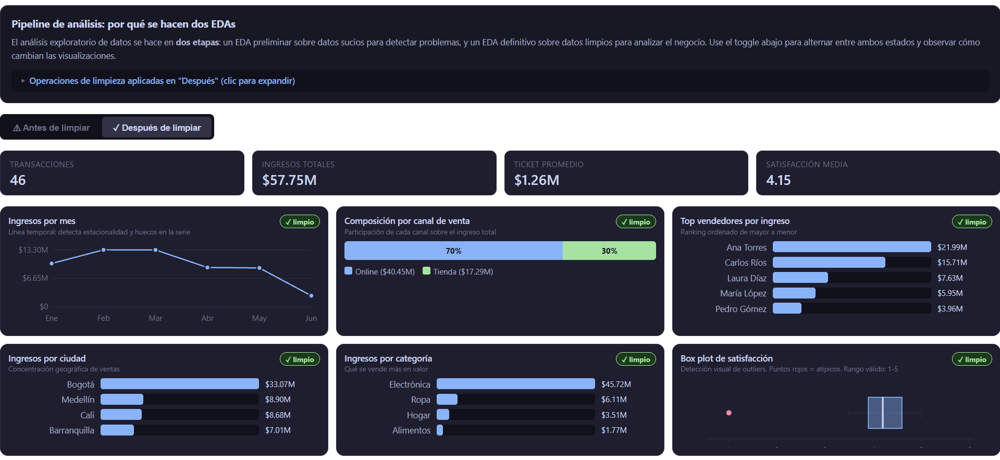

# Exploratory Data Analysis: Colombia Sales 2024

> Read in: **English** | [Español](README.es.md)

> Technical project documentation · Talento Tech AVD Bootcamp
> Instructor: Víctor Aguilar

---

## Business question

Which products are most profitable by city and sales channel in Colombia during 2024, and which sales representative shows the best performance based on customer satisfaction?

**Objective:** identify commercial optimization opportunities by cross-referencing geographic profitability, channel behavior, and individual sales force performance.

---

## Context

| Attribute | Value |
|---|---|
| Temporal scope | Year 2024 |
| Geographic scope | Colombia (4 main cities) |
| Analysis unit | Sales transaction |
| Audience | Commercial team and leadership |

---

## Dataset

- **Source:** `ventas_sucias.csv` file, a synthetic dataset generated for educational purposes to train data auditing and cleaning skills. Anomalies are intentionally injected.
- **Granularity:** one row represents one sales transaction. Primary key: `id`.
- **Original volume:** 49 records, 11 columns.
- **After cleaning:** 46 valid records. Two logical duplicates and one unrecoverable row are removed.
- **Derived column:** `mes` (YYYY-MM format) added for temporal grouping analysis.

---

## Data dictionary

| Column | Type | Description | Quality observations |
|---|---|---|---|
| `id` | int | Unique transaction identifier | No issues |
| `fecha` | string | Transaction date | Mixed formats: ISO, DD/MM/YYYY, YYYY/MM/DD |
| `vendedor` | string | Salesperson responsible | Some empty values; exclude, do not impute |
| `ciudad` | string | City of sale | Inconsistent capitalization, missing accents |
| `categoria` | string | Product category | Some empty values |
| `producto` | string | Specific product name | No relevant issues |
| `cantidad` | int | Units sold per transaction | Some empty values |
| `precio_unitario` | int | Unit price in Colombian pesos | Mixed format: `$`, thousand separators, commas |
| `ingreso_total` | int | quantity × unit_price | Some empty; reconstruct via multiplication |
| `canal_venta` | string | Commercialization channel | Synonyms: online/Online/e-commerce, fisica/TIENDA |
| `satisfaccion_cliente` | float | Customer rating, 1-5 scale | Out-of-range values: -1, 0, 8; one NaN |
| `mes` | string | Year-month derived from `fecha` | Generated during cleaning, YYYY-MM format |

---

## Quality findings

Audit performed through manual inspection and cross-validation of types, ranges, and patterns.

| Anomaly | Severity | Impact on analysis |
|---|---|---|
| Empty salesperson | High | Contaminates rankings with "(Blank)" or "Unknown" category |
| Out-of-range satisfaction | High | Distorts mean and median; affects segmentation |
| Channel synonyms | High | 6 values when there should be 2 |
| Mixed price format | Medium | Prevents arithmetic operations |
| Inconsistent capitalization | Medium | Creates false categories in groupings |
| Logical duplicates | Medium | Inflates revenue and transaction counts |
| Inconsistent date format | Medium | Time series with gaps |
| Empty fields | Low | Imputable via business rules |
| NaN in numerics | Low | Pandas excludes them automatically |

---

## Visual demo

The full interactive report is available at [`reports/eda_ventas_sucias_anomalias.html`](reports/eda_ventas_sucias_anomalias.html). Three key views:

**1. Analytical Memo & Data Card** — Project context, business question, and dataset overview.



**2. Anomaly Inspector** — Interactive table with row-level anomaly detection by type and severity.



**3. EDA Dashboard** — Executive view with KPIs, revenue trends, top performers, and outlier detection (box plot of satisfaction). All charts re-compute after the cleaning pipeline runs.



---

## Cleaning pipeline (Python / pandas)

### Dates

```python
df["fecha"] = pd.to_datetime(
    df["fecha"],
    infer_datetime_format=True,
    errors="coerce"
)
```

Automatic detection of mixed patterns. Unparseable values become NaT and are reviewed separately.

### Salesperson

```python
df["vendedor"] = df["vendedor"].str.strip().str.title()
sin_vendedor = df[df["vendedor"].isna() | (df["vendedor"] == "")]
df_ranking = df[df["vendedor"].notna() & (df["vendedor"] != "")]
```

No imputation: this is an identity field, not an attribute. Empty values are reported separately and excluded from rankings.

### City

```python
mapa_ciudades = {"bogota": "Bogotá", "medellin": "Medellín"}
df["ciudad"] = (df["ciudad"].str.strip().str.lower()
                .replace(mapa_ciudades)
                .str.title())
```

Dictionary of variants with accents to consolidate inconsistent capitalizations.

### Category

```python
df["categoria"] = df["categoria"].str.strip().str.title()
```

### Unit price

```python
df["precio_unitario"] = (df["precio_unitario"]
    .astype(str)
    .str.replace(r"[$,.]", "", regex=True)
    .astype(int))
```

The period is treated as a thousands separator. Validate against expected range before converting.

### Total revenue

```python
mask = df["ingreso_total"].isna()
df.loc[mask, "ingreso_total"] = (
    df.loc[mask, "cantidad"] * df.loc[mask, "precio_unitario"]
)
```

Deterministic reconstruction when both inputs exist. Nothing is invented that cannot be derived.

### Sales channel

```python
mapa_canal = {
    "e-commerce": "Online", "online": "Online",
    "fisica": "Tienda", "TIENDA": "Tienda", "tienda": "Tienda"
}
df["canal_venta"] = df["canal_venta"].str.strip().replace(mapa_canal)
```

Consolidate 6 variants into the 2 real business categories.

### Customer satisfaction

```python
df["satisfaccion_cliente"] = pd.to_numeric(
    df["satisfaccion_cliente"], errors="coerce"
).clip(1, 5)
```

Out-of-range values are clipped to the nearest valid boundary.

### Duplicates

```python
cols_clave = ["fecha", "vendedor", "ciudad", "producto",
              "cantidad", "precio_unitario"]
df = df.drop_duplicates(subset=cols_clave, keep="first").reset_index(drop=True)
```

Keep the first occurrence to preserve chronological traceability.

---

## Key analytical decisions

1. **Empty salesperson is not imputed.** Exclude and report separately. Imputing with "Unknown" in a ranking column distorts results: "Unknown" could lead the ranking by accumulating unattributed transactions.

2. **Satisfaction clipped with `clip(1, 5)`.** Values -1, 0, and 8 are capture errors. Clipping to the valid range preserves the transaction for other analyses without contaminating the metric.

3. **Duplicates removed by subset of key columns, not by full `id`.** Two records with different `id` but same date/salesperson/city/product/quantity/price are logically the same sale.

4. **Total revenue reconstructed, not imputed.** If `cantidad` and `precio_unitario` exist, revenue is computed deterministically. Nothing is invented.

5. **Unrecoverable row removed.** 1 record with multiple critical fields simultaneously empty (no possibility of reconstruction) is discarded and documented.

---

## Results

### Overall KPIs

| Metric | Value |
|---|---|
| Total revenue | $57,747,000 COP |
| Valid transactions | 46 |
| Average ticket | $1,255,370 COP |
| Average satisfaction | 4.15 / 5.0 |

### Revenue by city

| City | Total revenue | Transactions | Avg. ticket | % of total |
|---|---|---|---|---|
| Bogotá | $33,074,000 | 15 | $2,204,933 | 57.3% |
| Medellín | $8,898,000 | 11 | $808,909 | 15.4% |
| Cali | $8,677,000 | 11 | $788,818 | 15.0% |
| Barranquilla | $7,014,000 | 8 | $876,750 | 12.1% |
| No City | $84,000 | 1 | $84,000 | 0.1% |

### Revenue by channel

| Channel | Total revenue | Transactions | % of total |
|---|---|---|---|
| Online | $40,455,000 | 25 | 70.1% |
| Store (Tienda) | $17,292,000 | 21 | 29.9% |

### Top 5 products

| Product | Revenue |
|---|---|
| Laptop | $22,500,000 |
| Mobile phone (Celular) | $12,600,000 |
| Tablet | $7,200,000 |
| Headphones (Audífonos) | $3,420,000 |
| Blender (Licuadora) | $3,200,000 |

### Sales representative ranking

Score methodology:

```
score = (normalized_revenue) × (normalized_satisfaction)
normalized_revenue = revenue_per_rep / max(revenue)
normalized_satisfaction = mean_satisfaction / 5
```

| Position | Salesperson | Revenue | Avg. satisfaction | Transactions | Score |
|---|---|---|---|---|---|
| 1 | Ana Torres | $21,990,000 | 4.44 / 5 | 10 | 0.888 |
| 2 | Carlos Ríos | $15,715,000 | 3.98 / 5 | 9 | 0.569 |
| 3 | Laura Díaz | $7,625,000 | 4.19 / 5 | 9 | 0.291 |
| 4 | María López | $5,954,000 | 4.49 / 5 | 8 | 0.243 |
| 5 | Pedro Gómez | $3,963,000 | 3.63 / 5 | 9 | 0.131 |

**Conclusion:** Ana Torres leads both dimensions (combined revenue and satisfaction), with a score of 0.888 on a 0-to-1 scale.

---

## Analysis limitations

1. **Small sample size:** 46 transactions after cleaning are insufficient for robust statistical inference. Findings are descriptive, not predictive.

2. **No cost data:** no unit cost or associated expenses available. "Profitability" is approximated by revenue, not net margin.

3. **No customer information:** no demographic or loyalty data for advanced segmentation.

4. **Limited geographic coverage:** only 4 main cities; does not represent intermediate or rural zones.

5. **Satisfaction metric bias:** the 1-5 scale does not capture the emotional dispersion shown by broader scales such as NPS (Net Promoter Score, a 0-10 scale classifying customers as Detractors 0-6, Passives 7-8, and Promoters 9-10, producing an index between -100 and +100) or 1-10 surveys. A "very satisfied" customer and an "evangelist" are indistinguishable on a 1-5 scale.

**Recommendation:** treat these results as preliminary hypotheses, not closed conclusions. Validate with larger-volume datasets and cost data before making investment decisions.

---

## Repository structure

```
retail-data-cleaning-pipeline/
├── assets/
│   └── screenshots/
│       ├── 01_analytical_memo.png
│       ├── 02_anomaly_inspector.png
│       └── 03_eda_dashboard.png
├── data/
│   ├── raw/
│   │   └── ventas_sucias.csv          # Original dataset with injected anomalies
│   └── processed/
│       └── ventas_limpias.csv         # Clean dataset (46 records)
├── notebooks/
│   └── 01_limpieza_ventas.ipynb       # Full step-by-step cleaning pipeline
├── reports/
│   └── eda_ventas_sucias_anomalias.html   # Interactive anomaly inspector
├── .gitignore
├── README.md                              # This document (English)
└── README.es.md                           # Spanish version
```

---

## How to reproduce the analysis

```bash
# 1. Clone the repo
git clone https://github.com/va-mathml/retail-data-cleaning-pipeline.git
cd retail-data-cleaning-pipeline

# 2. Install dependencies
pip install pandas matplotlib jupyter

# 3. Run the notebook
jupyter notebook notebooks/01_limpieza_ventas.ipynb
```

The notebook is self-contained. All paths are relative. No external API keys required.

---

## About the author

Víctor Aguilar · Bootcamp AVD Instructor · Talento Tech 2026

Licensed Mathematician and Physicist (Universidad del Valle), AI/ML educator, and data analytics instructor based in Cali, Colombia. Currently building a portfolio of end-to-end data and ML projects aimed at international remote roles.

GitHub: [va-mathml](https://github.com/va-mathml) | LinkedIn: [vaguilar-ai](https://linkedin.com/in/vaguilar-ai)
